# > Divar.ir
## implementation of Frond-End of Divar WebSite

---

### - [Ali shairfy](https://github.com/alisharify7) < html-css-js-bootstrap >

---

# 01-Divar

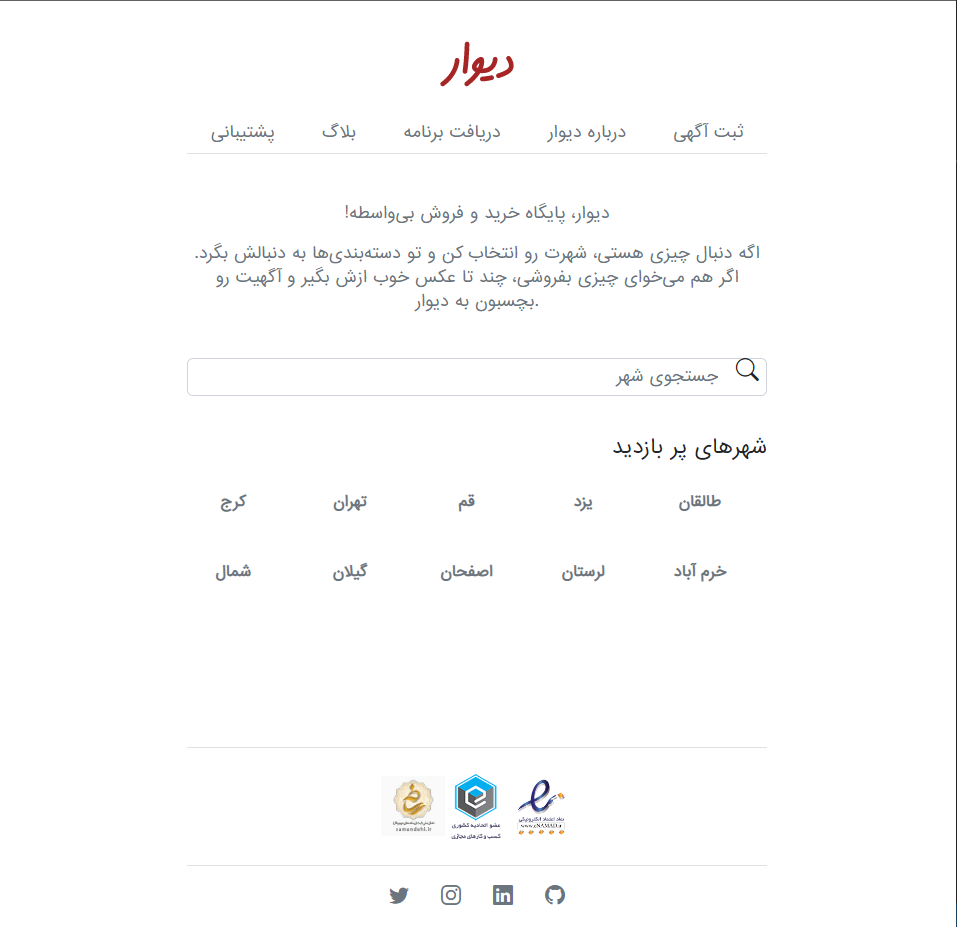
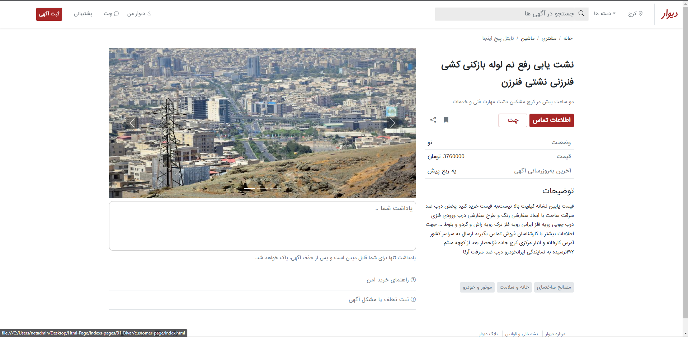
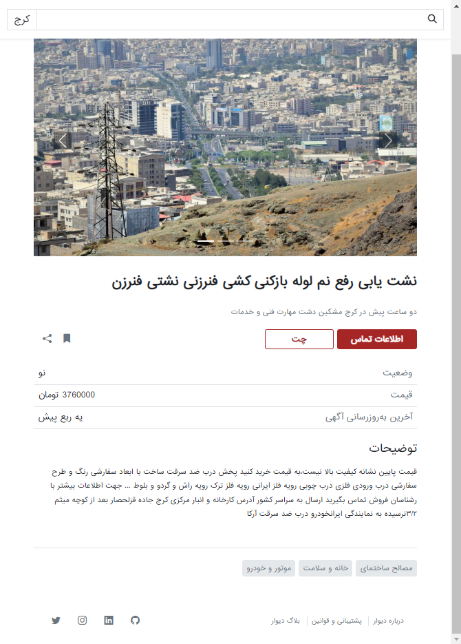
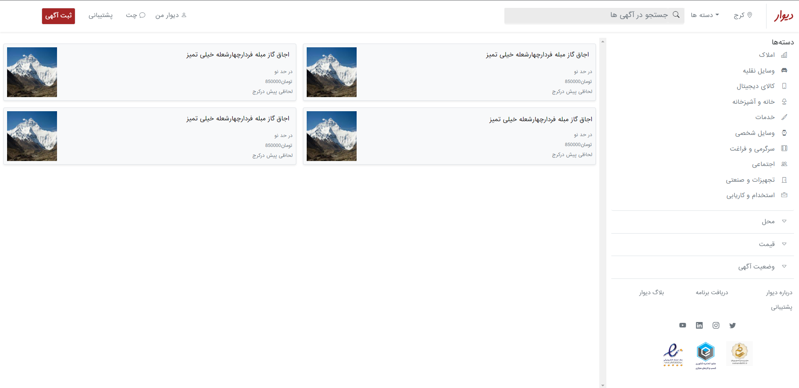
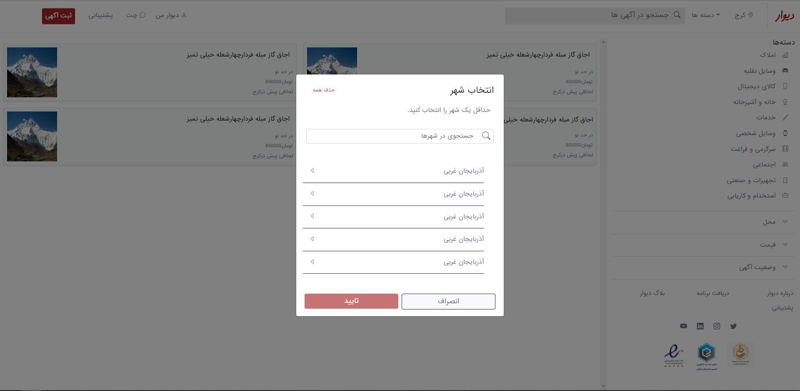
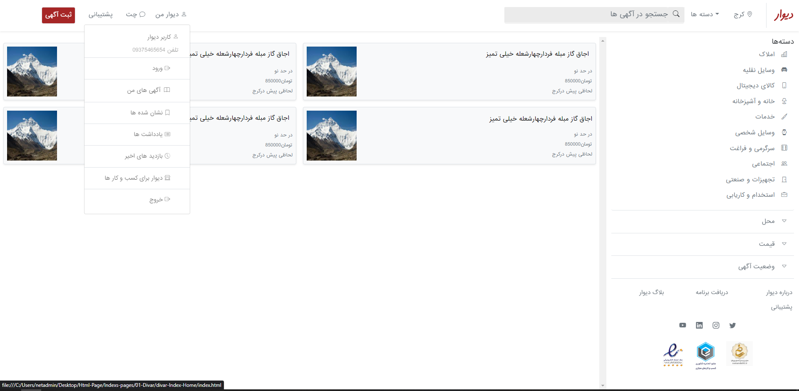
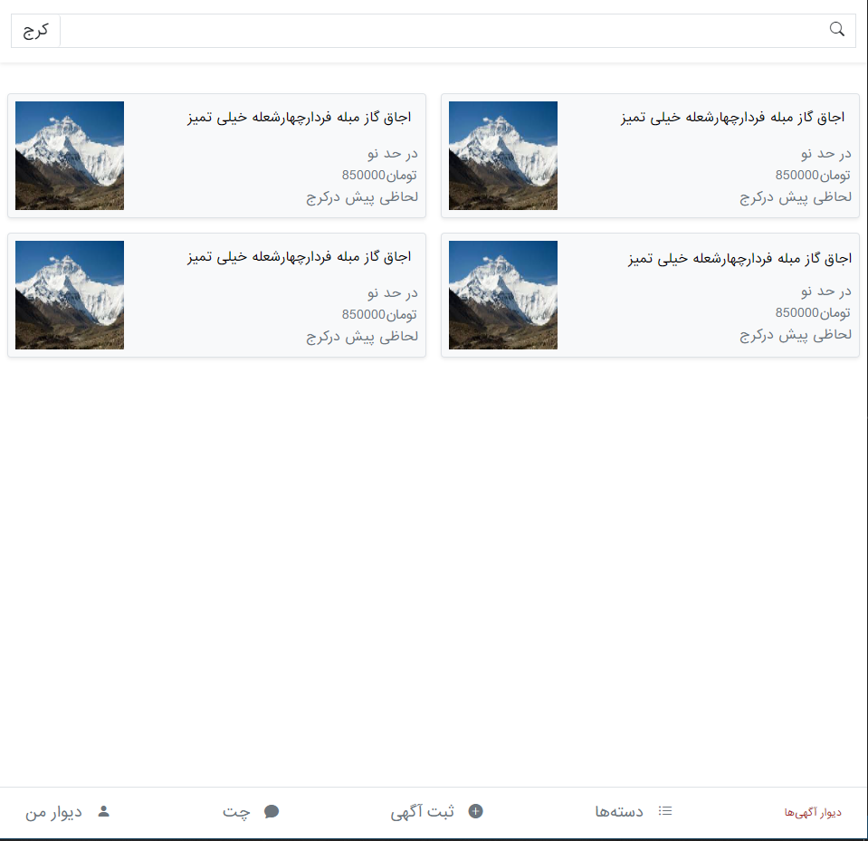

----

# 02 - Alborz Gym

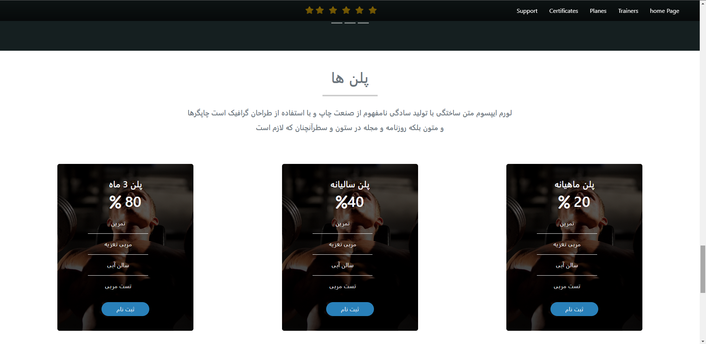
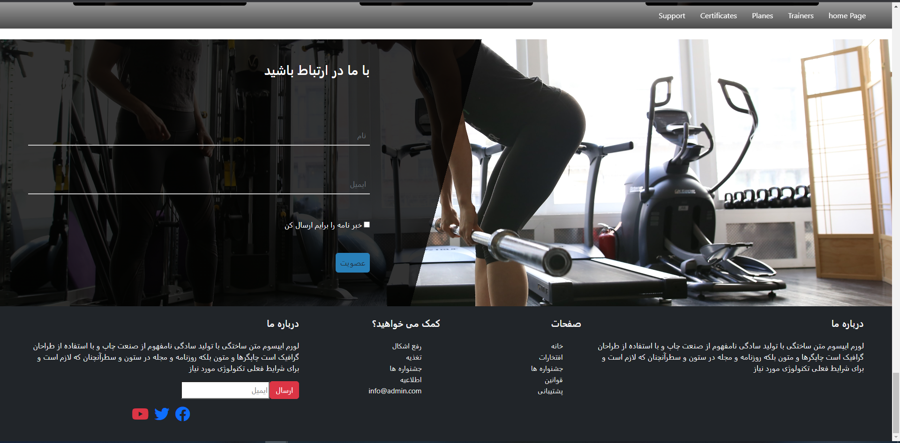
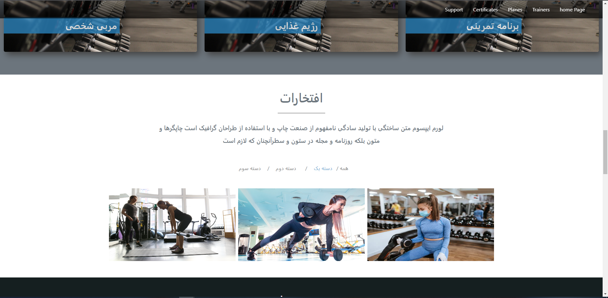
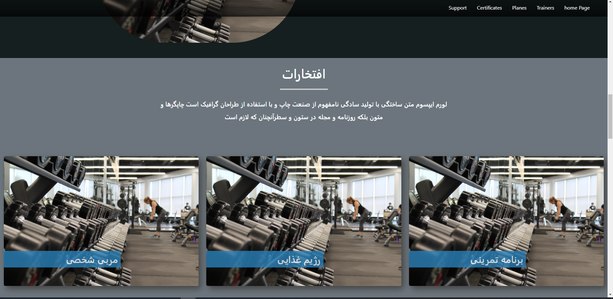

----
