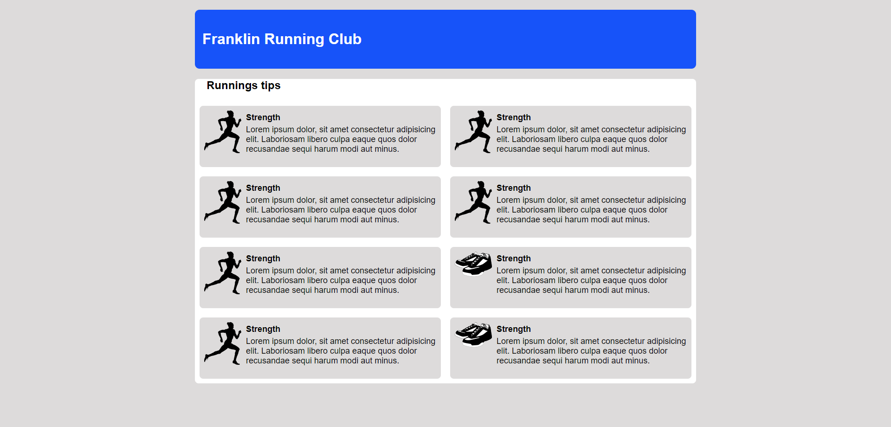

# implementation of Some Html Page's

How to clone:

        git clone https://github.com/alisharifyy/Html-Page.git
   
   
### <a href="./Twitter-homePage" >Twitter Home Page </a> [Flex-Box]
   

___
   
### <a href="./login-Profile" >Login Profile </a> [Flex-Box]
   

___

### <a href="./User-Profile" >User Profile </a> [Flex-Box]

___

### <a href="./Gym_page" >Gym Page</a> [Float]

