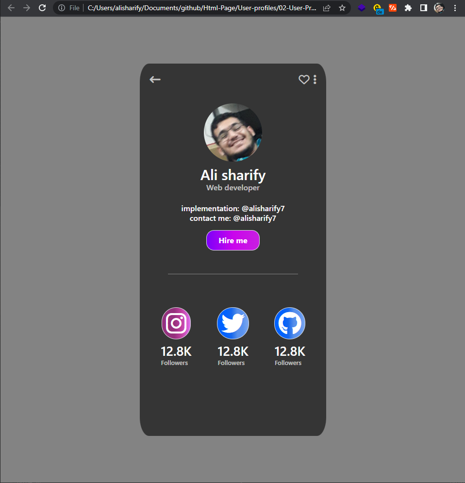
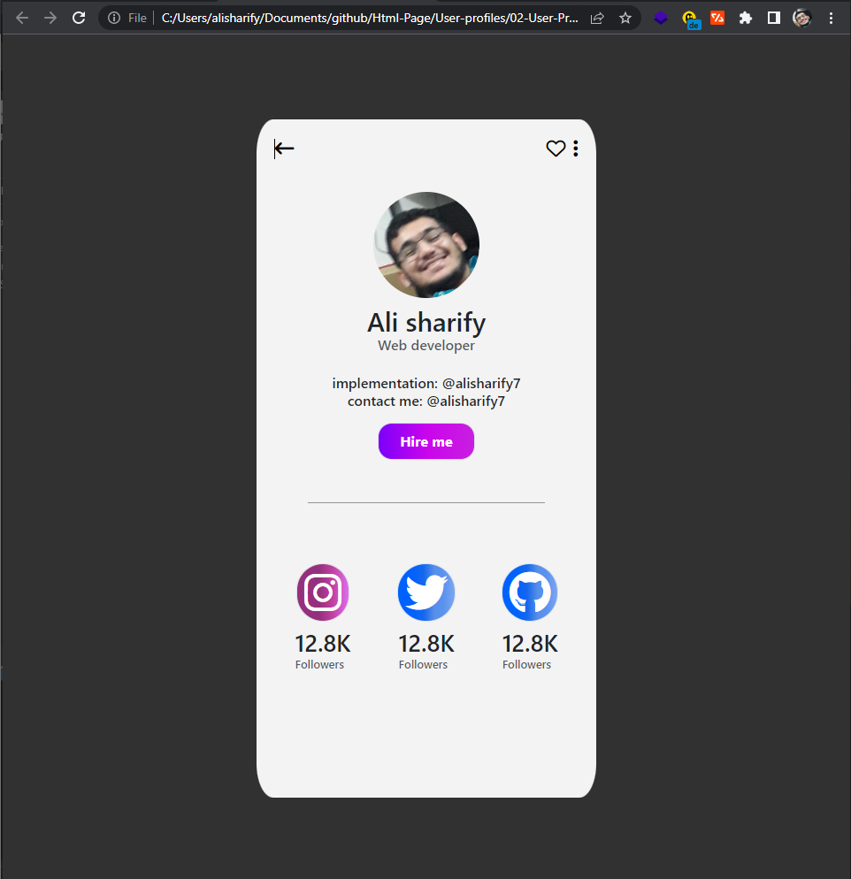

# 01-user-Profile
---

## For see Code <a href="./01-User-Profile">Click</a>

---
## For see Code <a href="./02-User-Profile">Click</a>

---

## For see Code <a href="./03-User-Profile">Click</a>

